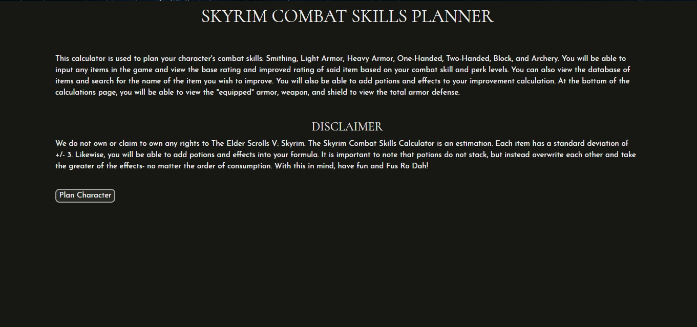
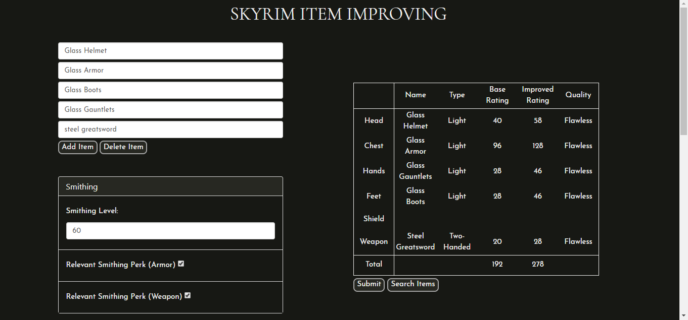
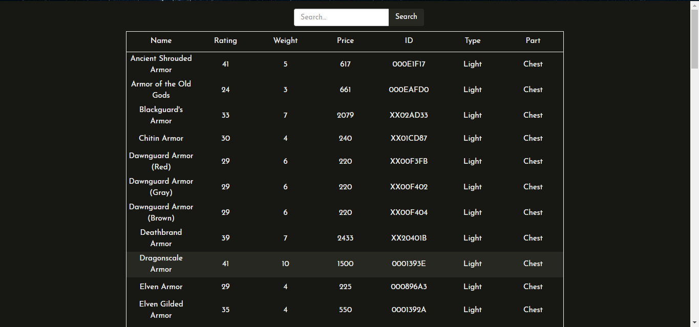
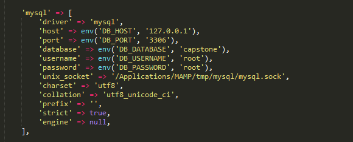

# Skyrim Combat Skills Planner
Developers: Megan Petruso and Hayden Grindstaff


## Description
In The Elder Scrolls V: Skyrim, players are able to create, enhance, and utilize weapons and armor for combat. The player’s character increases their skills, such as One-Handed, Light Armor, Blocking, etc., in order to level up. In doing so, a perk is available to the player, which adds a special effect in said skill tree in which the perk belongs. Although each perk is given a small description, there is no way to experience the effect of the perk until you take the time to level up and use a skill point to unlock said perk. Because of this, some players may feel like they wasted a skill point because the perk did not enhance their character in the way they expected. Our goal is to create a website for players to create and plan out their Skyrim character, with emphasis on how prospective perks affect numerical values for weapon damage and armor defense. The user will enter their character’s data, such as character level, skill level and perks achieved for relevant skill trees, and any active effects or any apparel that grants enhancements. The website will allow the user to plan a character build, see how much damage a weapon can do with specific perks or at a specific skill level, the effect certain potions will have upon crafting weapons or armor, which armor will provide the best protection, and understand what perks are ideal for the user’s character to have.

## Screenshots
The home page.
Calculations page.
User can search items in the database.

## Setup
#### PHP
Make sure that php 7.0 or greater is installed on your machine.


#### MAMP
Go to the following url [here](https://www.mamp.info/en/) and download MAMP. MAMP Pro is not required for this project. Follow the prompts to install MAMP. Once MAMP is properly installed, open the application and click "Start Servers". The Apache server and MySQL server will start to connect and run. The Apache Port is 80 and MySQL Port is 3306 by default. If you already have a different application running through those ports, you can change where apache and mysql runs through by clicking "Preferences->Ports". Likewise, you can view and change where the files for your web server will be saved on you computer by going to "Preferences->Web Server".

Once both the Apache and MySQL severs are up and running, you can select "Open start page". This will take you to your MAMP server home page. You can now download or clone the files in this repository to wherever you would like it to be on your computer. After the files have been downloaded, navigate back to your MAMP home page and select "My Website". This takes you to the directory of the files your web server points to on your computer. Clicking on each specific php file will display the contents in the database for that item. To view the database, navigate back to your MAMP home page and select "Tools->phpMyAdmin". This is where the database is located.


#### phpMyAdmin
In order to create the tables within the database, download the "capstone.sql" file in the respository. In phpMyAdmin, create a new database called "capstone". Then select "Import" at the top of the page, select the downloaded capstone.sql file from your computer to import, and click "Go". This will create all of the tables and data necessary for this project.


#### Laravel
To install Laravel, go to the following [link](https://laravel.com/docs/5.6/installation). For a more "follow-along" approach, you can visit [Laracasts](https://laracasts.com/series/laravel-5-from-scratch/episodes/1). Although the previous video is for Laravel 5.2 installation, initial installation of Laravel 5.6 and Composer is still the same. 

Once you have installed Laravel and Composer, download [Sublime text](https://www.sublimetext.com/). Download the capstone.zip folder from the repository, unzip it, and open the folder in Sublime text. In order to configure the MAMP with Laravel, you need to change a couple of things:

1. Run the following command in your Laravel project file:
  ```
  C:\Users\username\Documents\laravel\capstone>composer require "laravelcollective/html":"^5.4.0"
  ```
2. Navigate to your php configurations file (also known as php.ini file). Uncomment the line:
  ```
  extension=openssl
  ```
  You will then add the following line of code to the end of that list of extensions:
  ```
  extension=php_pdo_mysql.dll
  ```
3.  In your Laravel project file in Sublime, navigate to the app.php file, located in the config folder. Under 'providers' add the following line:
  ```
  Collective\Html\HtmlServiceProvider::class,
  ```
  Then add the following lines under 'aliases':
  ```
  'Form' => Collective\Html\FormFacade::class,
  'Html' => Collective\Html\HtmlFacade::class,
  ```
4. Navigate to the .env file in Sublime. You will change the DB_DATABASE to capstone and DB_USERNAME and DB_PASSWORD to root.

5. Lastly, you will configure the MAMP database in your database.php file under the config folder.


You have now congifured your Laravel files to communicate with MAMP. To run the capstone folder you downloaded from the repository, navigate to the capstone folder in your command line and execute the following command:
  ```
  php artisan serve
  ```
This will get the Laravel server running. Once up, you can navigate to the website given, which should be something like [<http://127.0.0.1:8000>](<http://127.0.0.1:8000>). Do also make sure your MAMP server is running in order for your database queries to execute.

Once you start up the server, you will see that the home page is routing to Laravel's default. To fix this, reset your local git repo to the HEAD with:
  ```
  git reset --hard HEAD
  ```

After you have all of desired files from the repository downloaded, MAMP installed, and the capstone.sql imported into your database in phpMyAdmin, Laravel and Composer installed, and MAMP configured with Laravel, you are ready to edit and experiement with the Skyrim Combat Skills Planner.

## Resources
#### Contributions
Would you like to contribute? Let us know and send us an email at: petrusomc@appstate.edu or grindstaffhl@appstate.edu.


#### Project Proposal
A [link](https://github.com/grindstaffhl/capstone/blob/master/ProjectProposal.md) to our project proposal.


#### Technical Report
A [link](https://github.com/grindstaffhl/capstone/blob/master/TechnicalReport.md) to our technical report.
